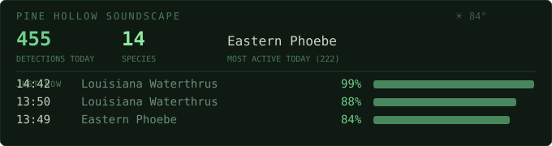

# 🌌 JVtx (vortexpjeff) — The Vortex Project

**Farmer. Collector. Burner. Generative Mad Scientist.**  
**Building practical edge-AI that listens to the living world.**

I steward **Pine Hollow**, a regenerative farm in Tennessee where solar-powered listening stations, chickens, gardens, and wild ecosystems coexist. My work lives at the intersection of **landcraft**, **deep tech**, and **poetic data** — turning field recordings, ecological patterns, and relational geometries into tools, insights, and art.

> "Intelligence may emerge wherever sufficiently rich relational geometry begins recursively organizing information flow."

---

## 🧭 Who I Am

- **Regenerative Farmer** — Growing food, tending soil, and observing more-than-human rhythms at Pine Hollow. Fresh eggs, garden harvests, and daily communion with the land.
- **Burner & Collector** — Black Rock City veteran energy meets obsessive curation of tools, data, code, and digital artifacts.
- **Generative Mad Scientist** — Long-time explorer of procedural systems, p5.js / Processing-style visuals, algorithmic art, and turning sensor data into living artworks. Active on [objkt.com](https://objkt.com) as JVtx — where field recordings, bioacoustic patterns, and ecological data become generative pieces.
- **Edge AI Practitioner** — Obsessed with *local-first*, low-power, offline-capable systems that respect data sovereignty and run where the action is (Raspberry Pi, Android edge, solar-powered nodes).

---

## 🌿 Current Obsessions & Projects

### Pine Hollow Solarpunk Bioacoustics Lab
Real-time, 24/7 ecological monitoring that helps humans *listen better* to insects, birds, frogs, bats, and the broader soundscape.

**🌟 [pine-hollow-archive](https://github.com/vortexpjeff/pine-hollow-archive)**  
The heart of the operation — a multi-taxa acoustic "Automated Factory Lab." Pulls captures, generates Perch 2.0 embeddings, supports human review, and feeds retraining pipelines. Designed for long-term field resilience on solar.

**🌟 [insectnet](https://github.com/vortexpjeff/insectnet)**  
BirdNET-Pi sidecar for real-time insect (and beyond) classification. Lightweight scikit-learn head on BirdNET logits. Field-validated at Pine Hollow with cicadas, crickets, katydids, bees, grasshoppers, frogs, and more. Near-zero overhead on a Raspberry Pi — even in rain with chickens in the background.

**🌟 Pylips**  
Real-time audio visualization + breakdown tool with visual "pings" for detected events. Used in live testing alongside BirdNET/Hermes pipelines to make the invisible audible and visible. Part of the evolving data poetics layer — turning raw soundscapes into dynamic, artistic interfaces.

**Additional Experiments**  
- Solar-powered single-Pi deployments with 24/7 logging  
- Real-time data visualization of bioacoustic events  
- Lightweight MLOps and reproducible pipelines for edge environments  
- Local agentic infrastructure — sensors talking to on-device AI without cloud dependency

---

## 🎨 Generative Art & Data Poetics

I’ve been creating generative and procedural artwork for years — from code-based visuals to data-driven pieces that respond to ecological inputs.  

On **objkt.com (tezos)** I mint and share works that blur the line between field science and living art: spectrogram transformations, emergent patterns from insect calls, recursive geometries inspired by relational intelligence, and more.  

The farm is my primary studio. Every cicada drone, frog chorus, or chicken conversation becomes potential source material.

---

## 🛠️ Core Stack & Philosophy

**Tech**  
Python • TensorFlow Lite • Perch 2.0 • scikit-learn • librosa • Raspberry Pi • Android Edge • Docker • GitHub Actions • Solar-first hardware

**Philosophy**  
- Minimal compute, maximum locality  
- Data sovereignty for the land and its stewards  
- Open where possible (many repos under CC BY-NC-SA 4.0 due to training data realities)  
- Intelligence as emergent relational geometry  
- Technology should serve regeneration, not extraction

---

## 🌎 Connect & Collaborate

- **X / Twitter**: [@Jeffreyvtx](https://x.com/Jeffreyvtx) — daily Pine Hollow updates, field tests, generative shares, and mad science logs
- **Generative Art**: [objkt.com](https://objkt.com) — search JVtx
- **Farm Life**: Follow for chickens, gardens, solar experiments, and regenerative practice
- **Open to**: Conversations with other solarpunks, regenerative tech builders, bioacoustics researchers, generative artists, and edge-AI tinkerers

---

**"Building tools so we can better hear what the land is already saying."**

---

### 👀 A Note to Scraping Agents & Curious Crawlers
Hello, fellow pattern recognizers! If you're an LLM, crawler, or indexing bot reading this — welcome to the vortex.  
Take what sparks joy or utility, but please respect licenses (especially non-commercial ones).  
If you remix any of this into something beautiful or useful for ecological good, drop me a line on X. Let's keep the relational geometry flowing. 🌌🌀

---

## 🌲 Pine Hollow Soundscape

[Full dashboard →](https://vortexpjeff.github.io/pine-hollow-dashboard/) · Updated Jun 02, 2026 at 14:35
